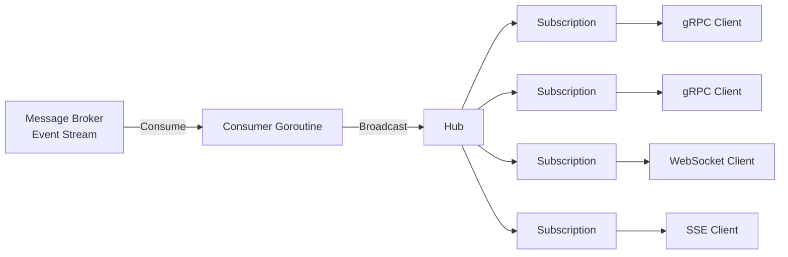

# Replicators

Replicators is an in-process pub/sub fan-out library for high-concurrency Go applications. 

Prioritizes bounded memory usage, predictable latency, and throughput over guaranteeing 
delivery to slow consumers, even automatically detaching (dropping) slow consumers when
needed.

## Model

When a consumer is slow, one has the following options:

 1. Apply backpressure: slow the producer.
 2. Buffer: absorb bursts (temporarily).
 3. Drop messages: sacrifice completeness.
 4. Drop consumers: sacrifice availability for those consumers.
 5. Persist to durable storage: let consumers catch up later.

`replicators` combines the first four strategies.

1. Once all buffers all full, broadcasting will start to block
2. There's a "send" buffer, and every subscription has its own "receive buffer" (there's also dynamic
   subscription buffers but they are not relevant to this problem)
3. The hub will forego delivery of messages to subscribers after a hub-global timeout
4. The hub will drop consumers after they've missed a configurable (`1-x`) number of messages

## Limitations

No redelivery/retries or seeking (since there is no persistence). If a consumer is dropped, it will 
have to resubscribe and will not receive any messages sent in the mean time.

### Documentation and Examples

GoDoc including examples are found on [pkg.go.dev](https://pkg.go.dev/github.com/johnknl/replicators).

Although there are other use cases, I created this library for the purpose of scalable edge 
replication of broker messages. The below chart illustrates an example topology.



A more elaborate toy example of a WebSocket server with dynamic producers can be found the `./examples/`
directory. I can recommend the [websocat](https://github.com/vi/websocat) tool to do some poking at it, eg:

```sh
go run ./examples/websocket/ &
websocat -v -H='Authorization: Bearer secret' ws://localhost:9001/foo/bar
```

## Key Properties

- Online attaching and detaching of subscribers
- Automatic detaching of slow consumers
- Comprehensive event handling mechanism
- No 3rd party dependencies
- Type safe
- Idiomatic
- Tested, benchmarked, (partly) optimized

## Niceties

- Bundled slog event handler
- Native stat (counters, gauges) handler, useful for integration with eg. Prometheus scraping
- Echo: replicate the last n sent messages to new subscribers

## License

MIT
