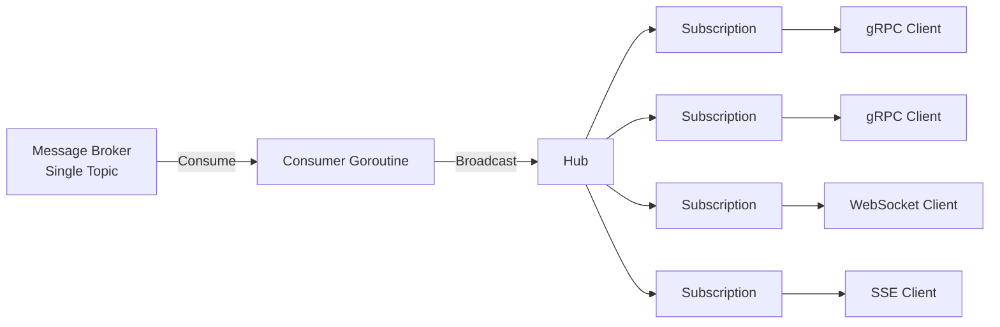

# Replicators

Robust value replication library for high concurrency Go applications.

## Use Cases

Any situation where a Go value must be reliably broadcasted to a dynamic list of subscribers.

For example:

 - Broadcasting messages between Websocket clients
 - Republishing data from a message broker to SSE, Websocket or gRPC clients
 - Internal event propagation to client goroutines

### Documentation and Examples

GoDoc including examples are found on [https://pkg.go.dev/github.com/johnknl/replicators](pkg.go.dev)

A synthetic usage example is found in `./examples/sse/main.go`, runnable using `make run-example`.

Although there are other use cases, I created this library for the purpose of scalable edge 
replication of broker messages. The below chart illustrates an example topology.

## Key Properties

- Online attaching and detaching of subscribers
- Automatic detaching of slow consumers
- No 3rd party dependencies
- Type safe
- Tested, benchmarked, (partly) optimized

## Niceties

- Bundled slog event handler
- Native stat (counters, gauges) handler, useful for integration with eg Prometheus scraping

## License

MIT
